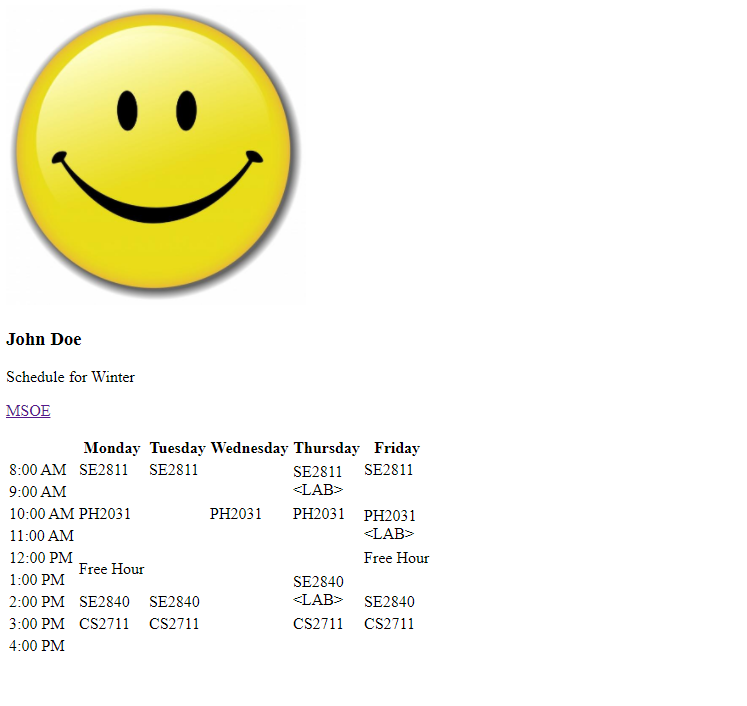
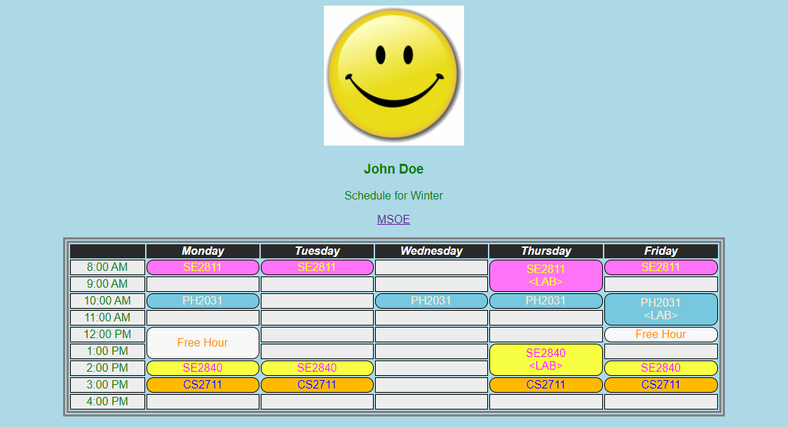
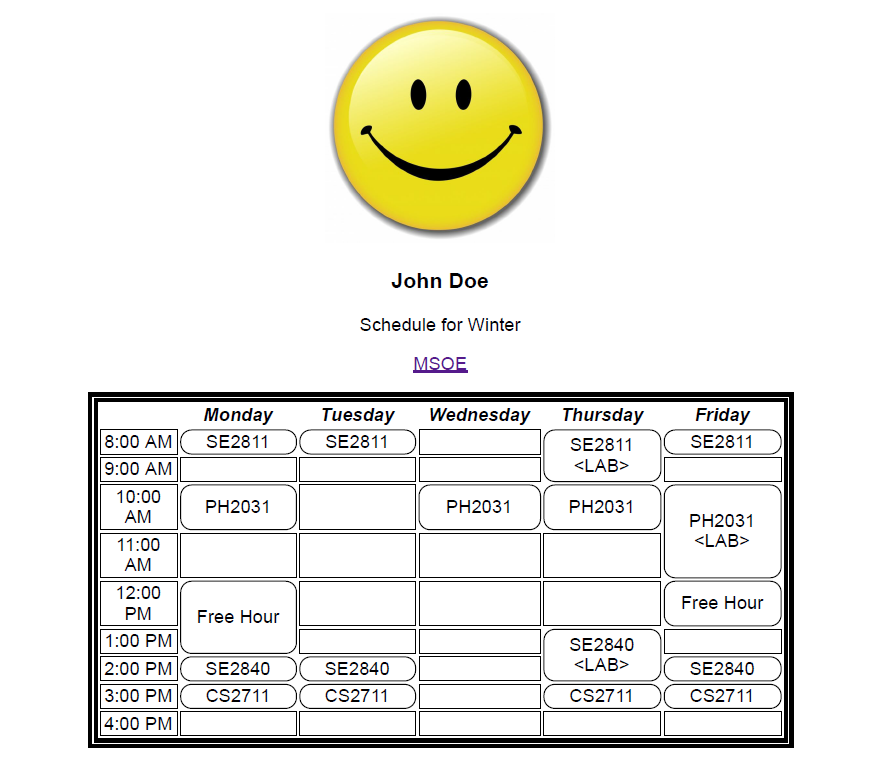

## Introduction

The start of any good web application begins with a good web page.  In this lab, you will be creating a web page for your schedule this term using HyperText Markup Language (HTML).  You will then stylize the web page using two cascading style sheets (CSS) in a separate files.

Work on the lab is to be done ***individually***.  You are welcome to collaborate with class members, but the project must be your own work.

## Outcomes

By the end of this lab, you will be able to:

- Write a web page using HTML to provide structure/content
- Use CSS to specify presentation and appearance to the page
- Use the HTML and CSS validator to verify markup validity

## References

For this lab you will be using HTML and CSS.  In addition to what was discussed in class the following resources may be helpful:

- HTML Reference from W3Schools: [https://www.w3schools.com/html/default.asp](https://www.w3schools.com/html/default.asp)
- CSS Reference from W3Schools: [https://www.w3schools.com/css/default.asp](https://www.w3schools.com/css/default.asp)
- HTML Validator: [http://validator.w3.org/](http://validator.w3.org/)
- CSS Validator: [http://jigsaw.w3.org/css-validator/](http://jigsaw.w3.org/css-validator/)

## Lab Project

For this project, you will create and validate a web page consisting of several files:

- an HTML file
- an image file (jpg or similar)
- a CSS file for browser formatting
- a CSS file for print formatting

The page will replicate your own personal course schedule for the current quarter.

NOTE: This should be your own schedule for this quarter, do not copy a schedule from another student or another location on the web.

### Part 1: HTML Content

First, create an HTML file and add the html markup for your individual schedule.  You'll have to make use of header, paragraph, link, image, and table HTML elements.  See the [HTML Reference](https://www.w3schools.com/html/default.asp) for syntax details. When you display this page in a browser, it will not have any style information so will follow the browser's default styling.

Use the [HTML Validator](http://validator.w3.org/) to make sure your markup does not contain any errors or warnings.

Sample un-styled webpage:

### Part 2: CSS styling

Once you have an HTML file with the necessary content, create a CSS file containing style rules.  Your stylized web page will need to follow a specific set of styling requirements.  Furthermore, your web page must be styled differently when displayed in a browser than when printed.  See [Development Requirements] for specific requirements.

You will need to create two (2) CSS files one for browser styling and one for print styling.  Using media queries will tell the browser which CSS file to use.  Consult the [CSS Reference](https://www.w3schools.com/css/default.asp) for additional help.

Here are some examples.  Your styled HTML page may look differently provided it meets the requirements defined in [Development Requirements].

Use the [CSS Validator](http://jigsaw.w3.org/css-validator/) to make sure your CSS does not contain any errors or warnings.

NOTE: Do not add CSS styling rules to your HTML file.  The styling should be done completely in the CSS file.

NOTE: You will need to add a links in the HTML file indicating the CSS files to be used for styling.  You will also have to indicate id and or class attributes on your HTML elements in order to set specific styles for different elements.

Sample styled page when displayed in the browser:

Sample styled page when printed:

## Development Requirements

Your completed web page files must conform to the following requirements:

- Your HTML and CSS files must pass validation with no errors or warnings using the [HTML validator](http://validator.w3.org/) and [CSS validator](http://jigsaw.w3.org/css-validator/)
- Your HTML and CSS files must all contain comment blocks at the time with:
  - Lab name 
  - You name 
  - Section number 
- Your HTML file must contain only structural markup; do ***NOT*** embed any CSS rules in the HTML file 
- Your HTML file must refer to external CSS files containing all the style rules (include a link in the header with appropriate media queries for browser and print)

Your web page must be formatted as follows:

- The title of the page (that appears on the browser tab) must contain your name
- All text must be centered
- When displayed in your browser screen, the page body must use a font that is not your browser's default font
- You must specify a custom color for your page body background and text (the text outside the table).  Any color is OK - just don't use the default browser background color and text color. 
- The generated page must contain at least one image (e.g. a photo of yourself).  Stylize the image so that it is displayed no larger than 200x200 pixels 
- Your name must appear below the picture and must be a level-3 header 
- A link titled "MSOE" should be below your name and link to [https://www.msoe.edu](https://www.msoe.edu)
- The page must make use of a table 
  - Use different borders for the cells vs the entire table 
  - The first column of cells of the table should occupy 10% of the table width 
  - The remaining 5 columns should each occupy 18% of the table width 
  - The table itself should be centered within the page body and occupy 85% of the page body width 
  - As the browser is resized, the table and cells should dynamically resize, and everything should remain centered 
  - The headers in the table should have a black background with a white text color, bolded and italicized 
  - Your courses should each use a different background color with a different contrasting text color, similar to above (choose you own colors)
  - Unused table cells can assume the background color of the page body or your own chosen color 
  - Courses that span multiple hours (like labs) must span multiple cells and must be merged 
  - Lab sections must contain the text "<lab>" with "<" and ">" marks under the course name 
  - The Monday and Friday "Free hour" must be included as if it were a course in your schedule.  The stylizing must follow the rules as courses.

Additional requirements for printed styling, when printed (or viewed in Print... preview of the browser):

- All text must be black 
- The page background must be white 
- The table heading (days of the week) must be black text on a white background (but still bold and italics)
- The table cell backgrounds must be either white or shades of grey 
- The table borders must be either black or shades of grey 
- Text should be in a font different from your browser's default ***AND*** different from the browser stylized page

NOTE: it's ok if the link and the image still appear colored in print mode (challenge: figure out how to make the image gray-scale).

### Additional Styling

Provided that your page fits the requirements describe above, additional styling is up to you.  Be creative.

## Testing and Validating

When testing, it can be helpful to change your browser's default color and font settings to something that will make it easy for you to verify that your styling fits the development requirements.  For example, set the font to 36pt "Comic Sans" and the background color to yellow.

Default styling can be changed as follows:

Firefox: Using this tutorial - [https://support.mozilla.org/en-US/kb/change-fonts-and-colors-websites-use](https://support.mozilla.org/en-US/kb/change-fonts-and-colors-websites-use)
Chrome: By modifying your appearance settings - Navigate your browser to: [chrome://settings/appearance](chrome://settings/appearance)
NOTE: Make sure your stylizing is correct when viewed in multiple browsers.

When testing Print...preview, make sure you select a printer that supports colors.  This is because some printer drivers "know" that a particular printer can only print black and white (even if the document contains colors), and will thus automatically display the preview in B/W.

NOTE: Some printer drivers have a "Print Background Graphics" option that you can select or deselect.  Make sure this option is SELECTED, so that the driver does not automatically disable the display of background colors.

## Deliverables

Include all HTML, CSS, and image files in your submission.  Make sure your name, lab name, and section number are in comments on ALL HTML and CSS files.

ALSO, include a text file report containing:

- Introduction - a description of the lab in your own words
- Summary - a reflection of what you learned in this lab
- Suggestions - a list of suggestions for improvement and/or what you enjoyed about this lab

NOTE: do ***NOT*** submit any IDE configuration files (.idea, project files, etc.).  Only submit your source files and report.

NOTE: If/when using resources from material outside what was presented in class (e.g., Google search, Stack Overflow, etc.) document the resource used in your submission.  Include exact URLs for web pages where appropriate.

Create a zip file of all files and submit before the due date.

## Grading Criteria

- (15 Points) Report
    - (5 Points) Introduction - a description of the lab in your own words
    - (5 Points) Summary - a reflection of what you learned in this lab
    - (5 Points) Suggestions - a list of suggestions for improvement and/or what you enjoyed about this lab
- (5 Points) Correct Submission - Followed submission instructions (e.g. IDE project files are not submitted)
- (10 Points) HTML and CSS Validation
  - Code passes the HTML validator without errors
  - Code passes the CSS validator without errors
- (35 Points) Browser Styling
  - Webpage is browser styled according to the requirements defined in Development Requirements
- (20 Points) Print Styling
  - Webpage is print styled according to the requirements defined in Development Requirements